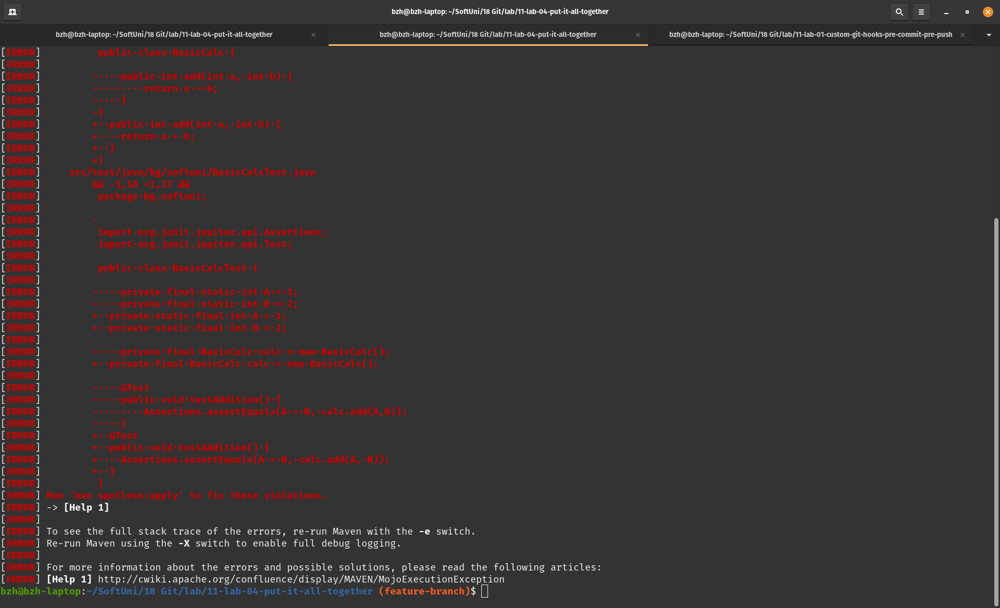
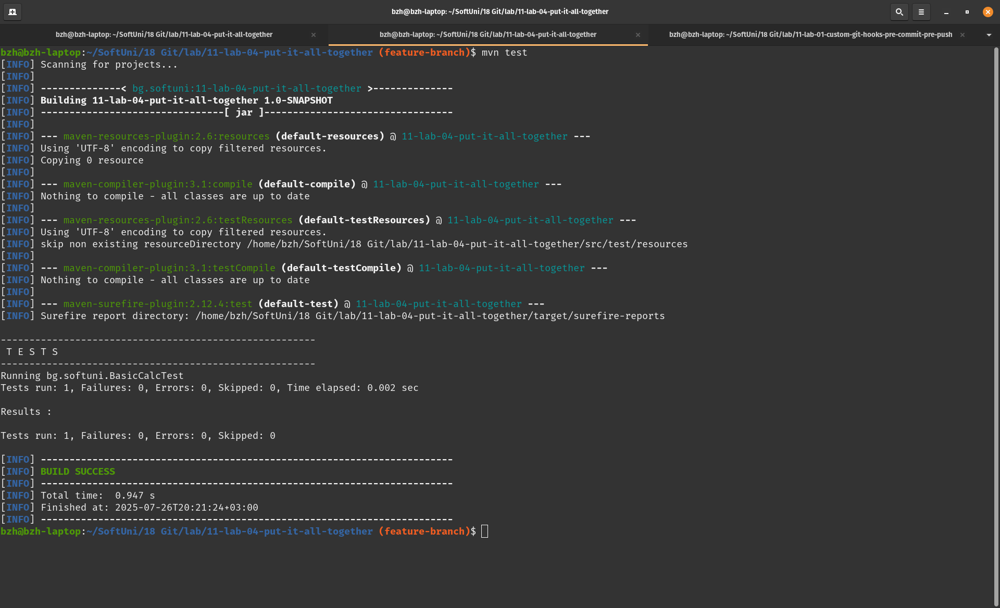
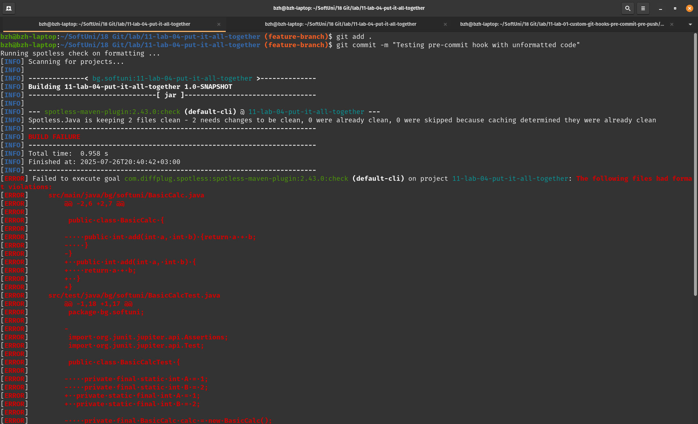
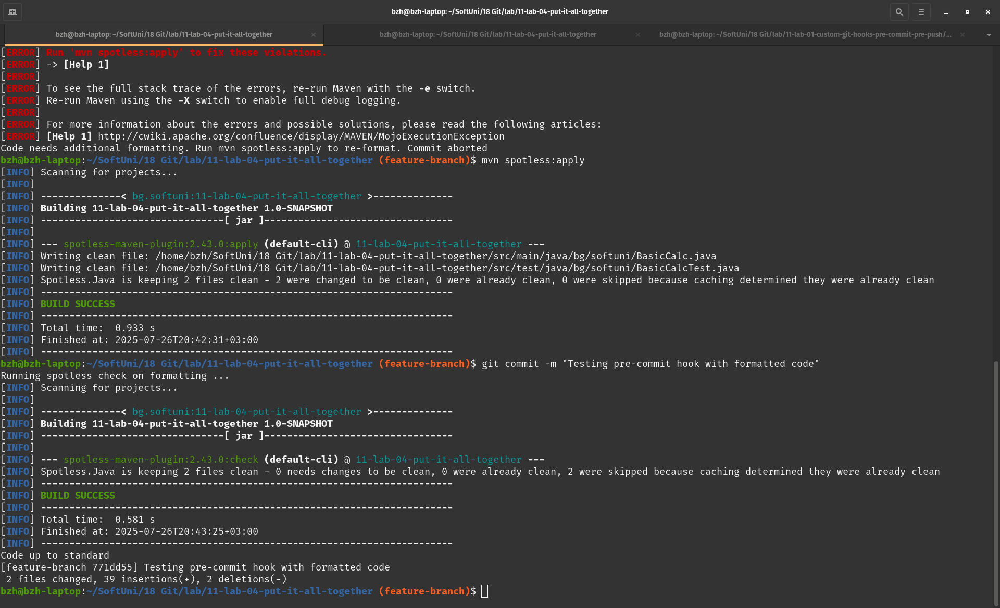
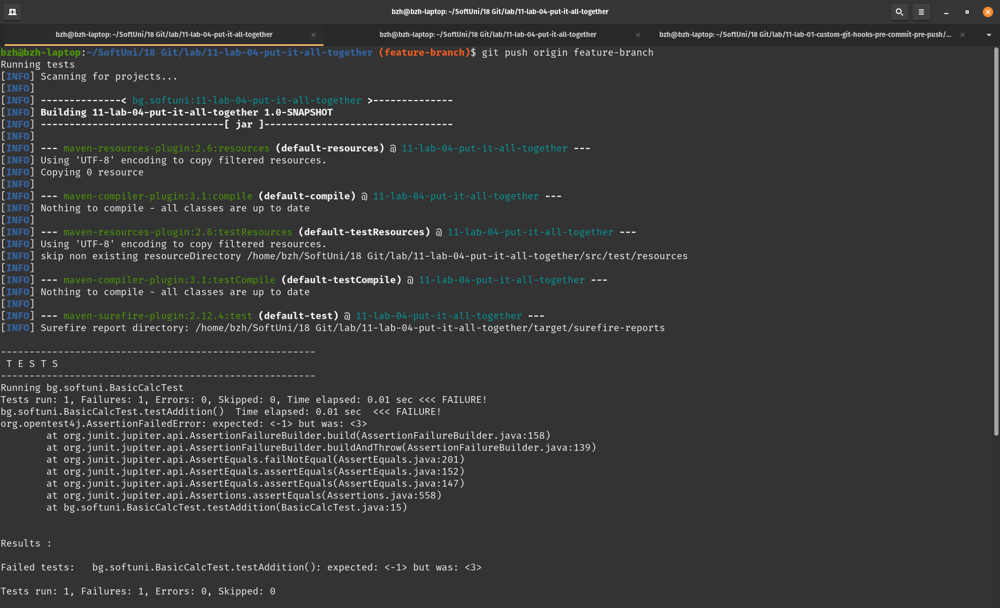
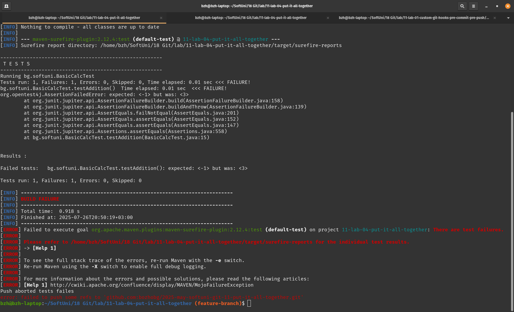
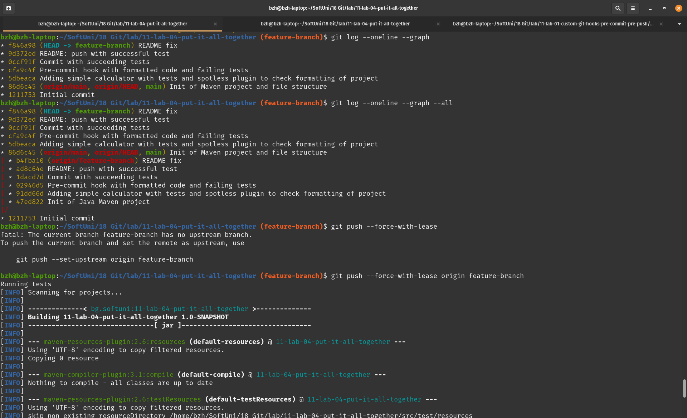
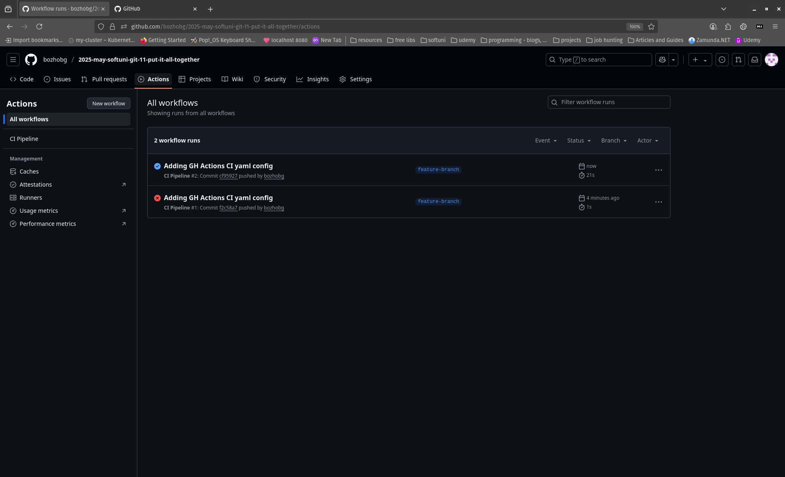
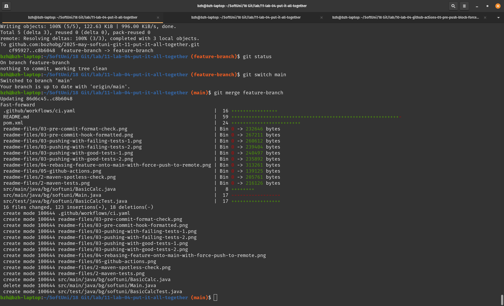
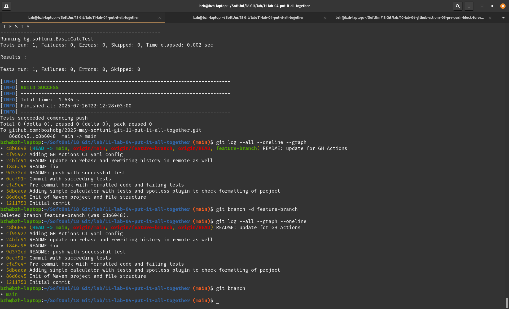

# 2025-may-softuni-git-11-put-it-all-together

1. Cloning remote repo


2. Initializing java maven project with dependencies and plugins



3. Adding git hooks to check formatting and run tests:

	 .git/pre-commit code formatting hook:

```
#!/bin/sh

echo "Running spotless check on formatting ..."

mvn spotless:check

if [ $? -ne 0 ]; then 
	echo "Code needs additional formatting. Run mvn spotless:apply to re-format. Commit aborted"
	exit 1
fi

echo "Code up to standard"
	
```





.git/hooks/pre-push to run tests: 

```
#!/bin/sh

echo "Running tests"

mvn test

if [ $? -ne 0 ]; then
	echo "Push aborted tests failes"
	exit 1
fi

echo "Tests succeeded comencing push"
```




4. Rebasing feature-branch onto main with push --force-with-lease to push new history to remote



5. Adding GitHub Actions and triggering them on push to remote
   1. firstly malformatted yaml configuration
   2. second push verifies maven project - runs tests as action
   


6. Merge and clean-up of feature-branch


